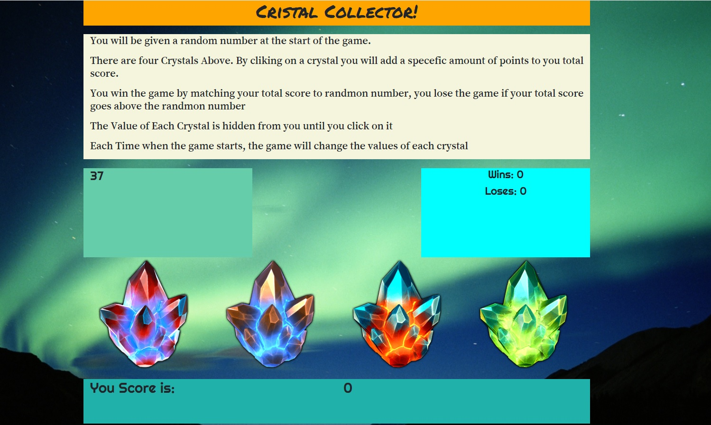

# CRYSTAL GAME

## Instructions

### You will be given a random number at the start of the game.
### There are four Crystals Above. By cliking on a crystal you will add a specefic amount of points to you total score.
### You win the game by matching your total score to randmon number, you lose the game if your total score goes above the randmon number
### The Value of Each Crystal is hidden from you until you click on it
### Each Time when the game starts, the game will change the values of each crystal

## Link to the Game  https://kliche1791.github.io/unit-4-game/.

## ScreenShot

